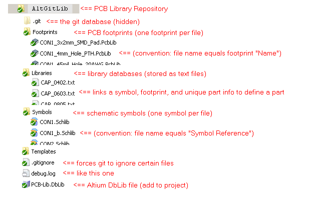

# AltGitLib
Parts Library for Altium in Git

## Requirements
 - Altium Designer 16 or higher
 - MS Windows 7, 8, 10
 - MS Office 2010 or higher, 64-bit (if 32-bit version see: [additional requirements](https://www.altium.com/documentation/altium-designer/using-database-libraries-with-32-bit-and-64-bit-altium-design-software-on-the-same-computer) )
 - Git version control (and TortoiseGit is recommended)
 
## How to use
 - NOTE: There are several hard-coded file paths used in this library solution (please someone fix this).  If you clone this repository to ```C:\repos\AltGitLib``` then it should work out-of-the-box.  But if you clone it elsewhere you must edit the paths:
   - The file /PCB-Lib.DbLib references the file ```C:\repos\AltGitLib\dblink.udl```,
   - The file /dblink.udl references the folder ```C:\repos\AltGitLib\Libraries```,
   
 - See example project ```C:\repos\AltGitLib\Templates\PCB4Layer\PCB4Layer.PrjPcb\PCB4Layer.PrjPcb```
  - This example project references the library and contains an .OutJob which pulls data from it to create a Bill-Of-Materials document.
  
## Structure of this library

